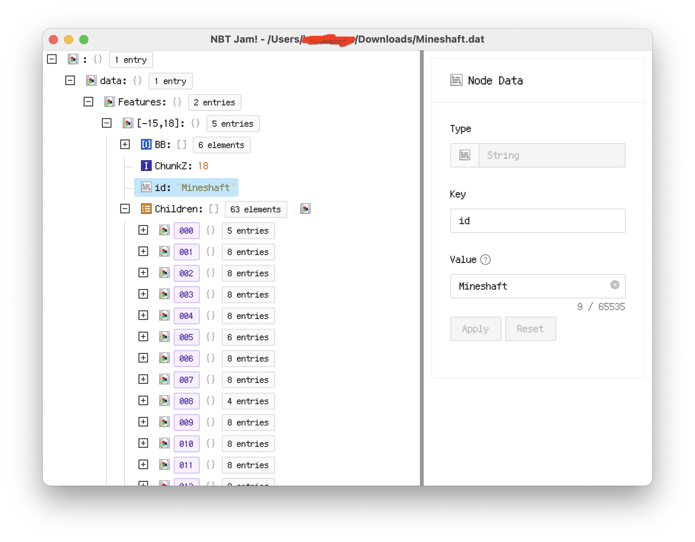

# NBT Jam!

A cross-platform Minecraft NBT file editor.

## Preview

## Features

+ Parse / view / edit Minecraft [NBT format files](https://minecraft.fandom.com/wiki/NBT_format);
  - level.dat
  - `<player>.dat`
  - idcounts.dat
  - villages.dat
  - raids.dat
  - ...
+ Modern GUI preference;

## TODO

+ Raw hex data view;
+ NBT node add / remove / ...;
+ Specified files view (e.g. level.dat structure view);
+ etc.
